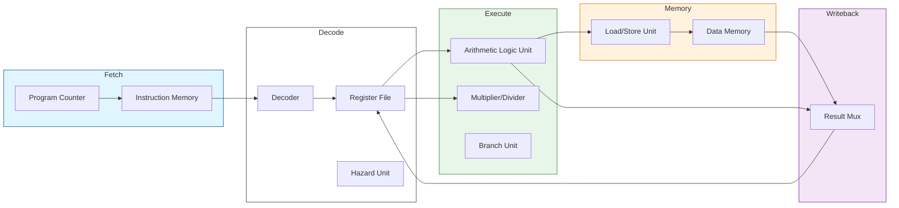

# IronCore Architecture

## System Overview

**IronCore** is a 64-bit RISC-V processor (RV64IM) implementing a classic 5-stage in-order pipeline. It is designed for clarity, synthesizability, and compliance with the unprivileged RISC-V specification.

### Key Parameters
*   **ISA**: RV64I (Base Integer) + M (Multiply/Divide)
*   **Privilege Level**: Machine Mode (M-Mode) only
*   **Bus Interface**: Wishbone B4 (Pipeline compliant)
*   **Reset Vector**: Configurable (Default: `0x8000_0000`)

---

## Pipeline Stages

The core uses a standard 5-stage pipeline: **Fetch (IF)**, **Decode (ID)**, **Execute (EX)**, **Memory (MEM)**, and **Writeback (WB)**.



### 1. Instruction Fetch (IF)
*   **Module**: `ironcore_if.sv`
*   **Function**: Generates the Program Counter (PC) and interfaces with the Instruction Memory via Wishbone.
*   **Features**:
    *   **Branch Prediction**: Integrates a Bimodal predictor (`ironcore_bp.sv`) to speculatively fetch instructions.
    *   **pc_redirect**: Handles branch mispredictions, jumps, and traps by flushing the pipeline and updating the PC.

### 2. Instruction Decode (ID)
*   **Module**: `ironcore_id.sv` & `ironcore_decoder.sv`
*   **Function**: Decodes the fetched instruction and reads source operands from the Register File.
*   **Decoder**: Pure combinational logic mapping opcodes to internal control signals (ALU op, Mem Read/Write, etc.).
*   **Register File**: 32x64-bit asynchronous read, synchronous write. x0 is hardwired to 0.

### 3. Execute (EX)
*   **Module**: `ironcore_ex.sv`
*   **Function**: Performs arithmetic, logic, and control flow operations.
*   **Components**:
    *   **ALU**: Handles ADD, SUB, SLT, XOR, OR, AND, SLL, SRL, SRA. Supports 64-bit and 32-bit (Word) variants.
    *   **MulDiv**: Iterative multiplier/divider. Uses state machine to handle multi-cycle operations (stalls pipeline until valid).
    *   **Branch Unit**: Compares operands for conditional branches (BEQ, BNE, BLT, BGE, etc.) and computes target addresses.

### 4. Memory (MEM)
*   **Module**: `ironcore_mem.sv`
*   **Function**: Interfaces with Data Memory via Wishbone.
*   **LSU**: Handles load/store operations, byte alignment, and sign extension (LB, LH, LW, LD, LBU, LHU, LWU).
*   **Traps**: Detects load/store misaligned exceptions and generates trap signals.

### 5. Writeback (WB)
*   **Logic**: Embedded in `ironcore_top.sv`
*   **Function**: Selects the final result (ALU, Memory, or PC+4) and writes it back to the Register File.

---

## Hazard Handling

The pipeline uses a combination of **Forwarding** and **Stalling** to resolve hazards, managed by `ironcore_hazard.sv`.

### Data Hazards
*   **Forwarding**: Data is passed directly from EX or MEM stages to the ID stage operands if the destination register matches a source register of the current instruction.
    *   **EX -> ID**: For back-to-back dependent instructions.
    *   **MEM -> ID**: For dependence with 1 instruction separation.
*   **Load-Use Stall**: If a Load instruction is in EX and the instruction in ID depends on the load result, the pipeline stalls for 1 cycle (bubbles inserted in EX).

### Control Hazards
*   **Speculation**: The branch predictor makes a guess in IF.
*   **Resolution**: Branch outcomes are resolved in EX.
*   **Misprediction**: If the prediction was wrong, the IF and ID stages are flushed, and the PC is redirected to the correct target.

---

## Interfaces

### Wishbone B4 (Master)
IronCore exposes two Wishbone Master interfaces (Instruction and Data).

| Signal | Direction | Description |
| :--- | :--- | :--- |
| `cyc_o` | Output | Cycle valid. Asserted for duration of transaction. |
| `stb_o` | Output | Strobe. Asserted when address/data is valid. |
| `we_o` | Output | Write Enable. 1 = Write, 0 = Read. |
| `adr_o` | Output | Address (64-bit). |
| `dat_o` | Output | Data Output (64-bit). |
| `sel_o` | Output | Byte Select (8 bits). |
| `ack_i` | Input | Acknowledge. Slave asserts to complete cycle. |
| `dat_i` | Input | Data Input (64-bit). |

### Interrupts & CSRs
*   **M-Mode CSRs**: `mstatus`, `mie`, `mtvec`, `mepc`, `mcause`, `mip`.
*   **Traps**: Supports precise exceptions for Illegal Instruction, Misaligned Access, and Environment Calls (`ecall`).
*   **Interrupts**: `meip` (External) and `mtip` (Timer) are supported via `mip` CSR.

---

## Source Directory Structure
```text
rtl/
├── include/           # Packages and parameters
│   └── ironcore_pkg.sv
├── ironcore_if.sv     # Instruction Fetch
├── ironcore_id.sv     # Instruction Decode
├── ironcore_ex.sv     # Execute
├── ironcore_mem.sv    # Memory
├── ironcore_alu.sv    # Arithmetic Logic Unit
├── ironcore_decoder.sv# Instruction Decoder
├── ironcore_hazard.sv # Hazard Unit
└── ironcore_top.sv    # Top-Level Wrapper
```
